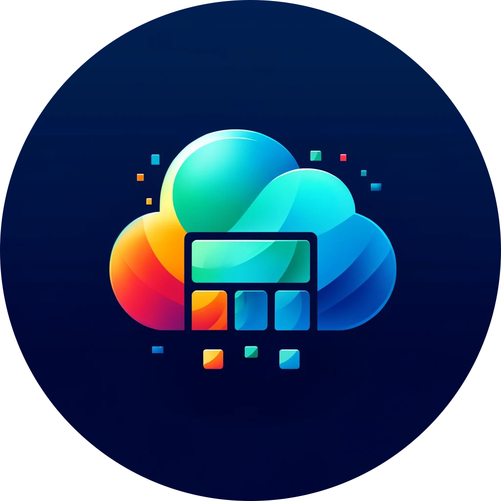

# Kapheira

**Consultancy • Software Development • Cloud Architecture**

---

## Table of Contents

* [About Us](#about-us)
* [Our Services](#our-services)
  * [Consultancy](#consultancy)
  * [Software Development](#software-development)
  * [Cloud Architecture](#cloud-architecture)
* [Why Kapheira?](#why-kapheira)
* [How We Work](#how-we-work)
* [Our Clients](#our-clients)
* [Contact Us](#contact-us)
* [License](#license)

---

## About Us

Kapheira is a forward-thinking company dedicated to delivering top-tier consultancy, innovative software development, and robust architectural solutions. With a focus on excellence and client success, we partner with organizations to transform ideas into reality and drive sustainable growth.

**Founded:** 2023
**Headquarters:** Paris, France
**Website:** [www.kapheira.cloud](https://www.kapheira.cloud)

---

## Our Services

At Kapheira, we offer a comprehensive suite of services tailored to meet the unique needs of each client.

### Consultancy

* Strategic IT Advisory
* Digital Transformation Roadmapping
* Business Process Optimization
* Technology Feasibility Studies
* Regulatory & Compliance Guidance

### Software Development

* Custom Application Design & Development
* Web & Mobile Solutions (React, Vue, Flutter)
* API & Microservices Architecture
* DevOps & CI/CD Implementation
* Quality Assurance & Testing

### Cloud Architecture

* Enterprise & Solution Architecture
* Cloud Migration & Infrastructure Design (AWS, Azure, GCP)
* Data Architecture & Analytics Platforms
* Systems Integration
* Security & Compliance Architecture

---

## Why Kapheira?

* **Expertise:** A multidisciplinary team of seasoned consultants, architects, and developers.
* **Collaboration:** Agile, transparent processes with frequent deliverables and feedback loops.
* **Innovation:** Cutting-edge tools and frameworks to future-proof your business.
* **Quality:** Rigorously tested solutions backed by best practices.
* **Support:** End-to-end support from planning through deployment and beyond.

---

## How We Work

1. **Discovery & Assessment**: Understand your goals, challenges, and technical landscape.
2. **Planning & Design**: Craft a tailored roadmap, architecture schematics, and implementation plan.
3. **Implementation**: Develop, test, and iterate with continuous client collaboration.
4. **Delivery & Review**: Deploy solutions, validate success criteria, and gather feedback.
5. **Support & Evolution**: Provide ongoing maintenance, updates, and strategic advice.

---

## Our Clients

We’ve partnered with organizations across industries:

* Finance & Banking
* Healthcare & Life Sciences
* Retail & E-commerce
* Manufacturing & Logistics
* Non-profit & Government

> “Kapheira’s expertise transformed our digital strategy and accelerated time-to-market by 70%.” — Client Testimonial

---

## Contact Us

* **Email:** [contact@kapheira.eu](mailto:contact@kapheira.eu)
* **LinkedIn:** [Kapheira](https://www.linkedin.com/company/kapheira)

---

## License

This repository and its contents are © 2025 Kapheira. All rights reserved.

---

*Built with ❤️ by Kapheira*
